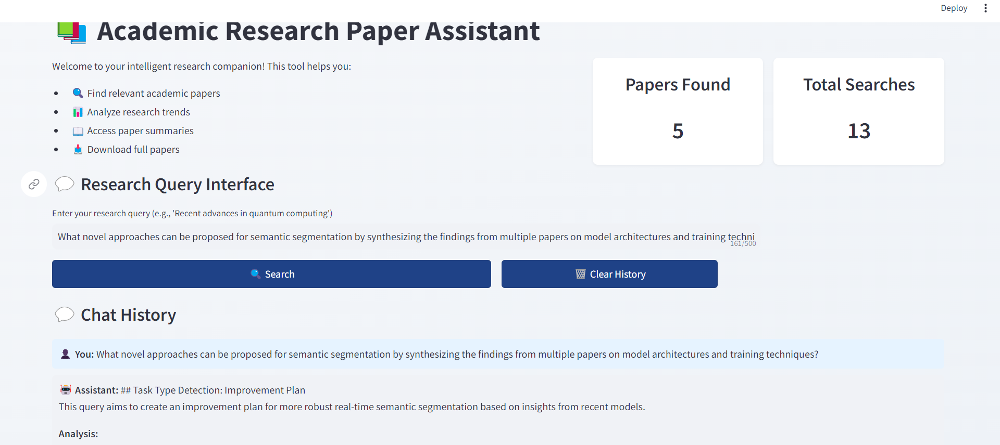

# Academic Research Paper Assistant

An intelligent assistant that helps researchers search, analyze, and synthesize academic papers using Large Language Models (LLMs). The application provides multi-agent capabilities for paper search, question answering, summarization, and future research direction generation.

[Watch the Project Demonstration on YouTube](http://www.youtube.com/watch?v=DpunojtYDFE)



## Try It Out

You can directly interact with the assistant on [Hugging Face spaces](https://huggingface.co/spaces/SanketAI/Academic-Research-Paper-Assistant).

   **Tip:** In Streamlit website settings (by clicking on 3 dots in top right), change theme mode to "Light Mode" instead of "Dark Mode."

## Features

- **Paper Search**: Search and retrieve relevant research papers from Arxiv
- **Question Answering**: Get answers about specific papers or content with source citations
- **Summarization**: Extract key findings and trends from multiple papers
- **Future Works Generation**: Generate research directions and improvement plans
- **Interactive UI**: User-friendly Streamlit interface for paper browsing and chat

## Architecture

The application uses a multi-agent system with the following components:

- **Intent Agent**: Classifies user queries to route to appropriate specialized agents
- **Search Agent**: Retrieves and processes papers from Arxiv
- **QA Agent**: Handles specific questions about paper content
- **Summarization Agent**: Synthesizes information across multiple papers
- **Future Works Agent**: Generates research directions and review papers

## Technology Stack

- **Frontend**: Streamlit
- **Backend**: FastAPI
- **LLM Integration**: Google Generative AI
- **Vector Store**: FAISS
- **Document Processing**: LangChain
- **PDF Processing**: PDFMiner

## Installation

1. Clone the repository:
```bash
git clone https://github.com/Sanket-Kathrotiya/Academic-Research-Paper-Assistant.git
```

2. Create and activate a virtual environment:
```bash
conda create --name venv
conda activate venv
```

3. Install dependencies:
```bash
pip install -r requirements.txt
```

4. Set up environment variables:
```bash
# Create .env file
GOOGLE_API_KEY=your_api_key_here
```

## Important Note

**⚠️ Temporary API Key Usage:**
> [!WARNING]
> To enable testing without requiring additional setup, I have temporarily provided the Google API key directly in the code and GitHub repository. This is to allow the recruitment teams to run the project without any configuration changes. Please note:
> - **Do not share or use this API key outside of this project.**
> - I will remove the API key from the codebase after a few days.

**If you plan to continue using the project, update the code to include your own API key and follow secure practices for handling sensitive data.**


## Why Gemini API Instead of a Local LLM?
> [!NOTE]
> I initially tried using Ollama to run the Qwen-32B model and Qwen-14B model locally, but my system specifications were insufficient for this large model. The Gemini API provides a reliable, high-performance alternative that allows me to access advanced LLM capabilities without the need for specialized hardware.

## Usage

1. Start the application:
```bash
cd src
streamlit run app.py
# or run  following 
# python3 -m streamlit run app.py
```

2. Open your browser and navigate to `http://localhost:8501` 

   **Tip:** In Streamlit website settings (by clicking on 3 dots in top right), change theme mode to "Light Mode" instead of "Dark Mode."
  
4. Enter your research topic or question in the chat interface

5. Select papers of interest from the timeline view

6. Interact with the assistant through natural language queries

## Example Queries

- "Find papers about text-to-SQL"
- "What are the key findings in Paper X?"
- "Summarize the advancements in this field over the last 5 years"
- "What are potential future research directions?"
- "Generate a review paper outline"

## Project Structure

```
src
├── agents
│   ├── __init__.py
│   ├── dummy
│   ├── future_works_agent.py
│   ├── intent_agent.py
│   ├── qa_agent.py
│   ├── search_agent.py
│   └── summarization_agent.py
├── config
│   └── config.py
├── app.py
├── router.py
├── README.md
└── requirements.txt
```


## Acknowledgments

- [Streamlit](https://streamlit.io/) for the web interface framework
- [LangChain](https://python.langchain.com/) for LLM integration
- [Google Generative AI](https://ai.google.dev/) for the language model
- [Arxiv](https://arxiv.org/) for the research paper database

## Requirements

See `requirements.txt` for a full list of dependencies. Key requirements include:

```
langchain-google-genai
langchain-community
arxiv
pymupdf
faiss-cpu
pdfminer.six
google-generativeai
streamlit
fastapi
langchain
```


