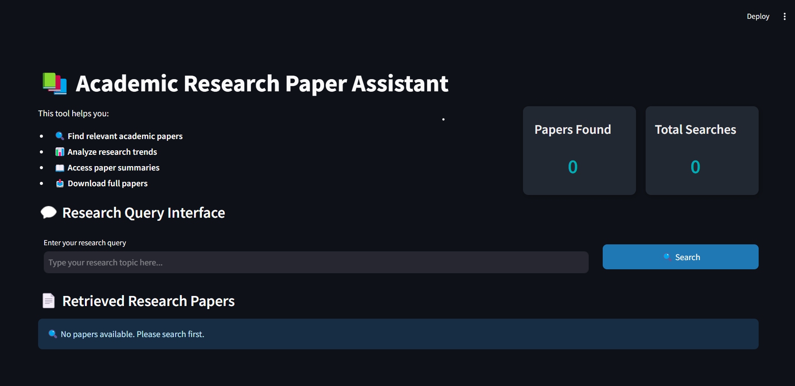
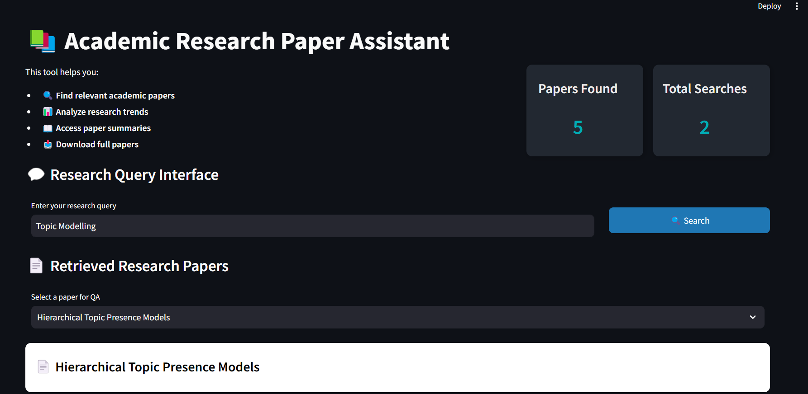
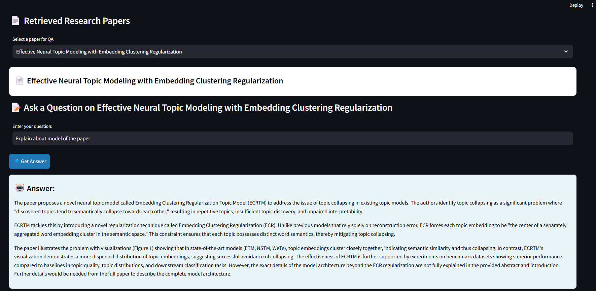

# Academic Research Paper Assistant

An intelligent assistant that helps researchers search, analyze, and synthesize academic papers using Large Language Models (LLMs). The application offers multi-agent capabilities for paper search, question answering, summarization, and future research direction generation.



---

## Table of Contents

- [Features](#features)
- [Architecture](#architecture)
- [Technology Stack](#technology-stack)
- [Installation](#installation)
- [Usage](#usage)
- [Example Queries](#example-queries)
- [Project Structure](#project-structure)
- [Acknowledgments](#acknowledgments)
- [Requirements](#requirements)
- [License](#license)
- [Contact](#contact)

---

## Features

- **Paper Search**: Retrieve relevant research papers from Arxiv.
- **Question Answering**: Get detailed answers about paper content with source citations.
- **Summarization**: Extract key insights and trends from multiple papers.
- **Future Works Generation**: Generate potential research directions and improvement plans.
- **Interactive UI**: User-friendly interface built with Streamlit for paper browsing and chatting.

---

## Architecture

The application employs a multi-agent system that includes:

- **Intent Agent**: Classifies user queries to direct them to the appropriate specialized agents.
- **Search Agent**: Retrieves and processes research papers from Arxiv.
- **QA Agent**: Handles specific questions related to paper content.
- **Summarization Agent**: Synthesizes key findings from multiple papers.
- **Future Works Agent**: Proposes future research directions and outlines for review papers.

---

## Technology Stack

- **Frontend**: [Streamlit](https://streamlit.io/)
- **Backend**: [FastAPI](https://fastapi.tiangolo.com/)
- **LLM Integration**: [Google Generative AI](https://ai.google.dev/)
- **Vector Store**: FAISS
- **Document Processing**: [LangChain](https://python.langchain.com/)
- **PDF Processing**: PDFMiner

---

## Installation

To set up the project locally, follow these steps:

1. **Clone the repository:**

   ```bash
   git clone https://github.com/digantadiasi195/academic-research-assistant.git
```

2. Create and activate a virtual environment:
```bash
conda create --name venv
conda activate venv
```

3. Install dependencies:
```bash
pip install -r requirements.txt
```

4. Set up environment variables:
```bash
# Create .env file
GOOGLE_API_KEY=your_api_key_here
```


## Usage

1. Start the application:
```bash
cd src
streamlit run app.py
# or run  following 
# python3 -m streamlit run app.py
```

2. Open your browser and navigate to `http://localhost:8501` 

   **Tip:** In Streamlit website settings (by clicking on 3 dots in top right), change theme mode to "Light Mode" instead of "Dark Mode."
  
4. Enter your research topic or question in the chat interface

5. Select papers of interest from the timeline view

6. Interact with the assistant through natural language queries


## Example Queries

- "Find papers about text-to-SQL"
- "What are the key findings in Paper X?"
- "Summarize the advancements in this field over the last 5 years"
- "What are potential future research directions?"
- "Generate a review paper outline"
- 
## Project Structure

```
src
├── agents
│   ├── __init__.py
│   ├── dummy
│   ├── future_works_agent.py
│   ├── intent_agent.py
│   ├── qa_agent.py
│   ├── search_agent.py
│   └── summarization_agent.py
├── config
│   └── config.py
├── app.py
├── router.py
├── README.md
└── requirements.txt
```


## Acknowledgments

- [Streamlit](https://streamlit.io/) for the web interface framework
- [LangChain](https://python.langchain.com/) for LLM integration
- [Google Generative AI](https://ai.google.dev/) for the language model
- [Arxiv](https://arxiv.org/) for the research paper database

## Requirements

See `requirements.txt` for a full list of dependencies. Key requirements include:

```
langchain-google-genai
langchain-community
arxiv
pymupdf
faiss-cpu
pdfminer.six
google-generativeai
streamlit
fastapi
langchain
```
